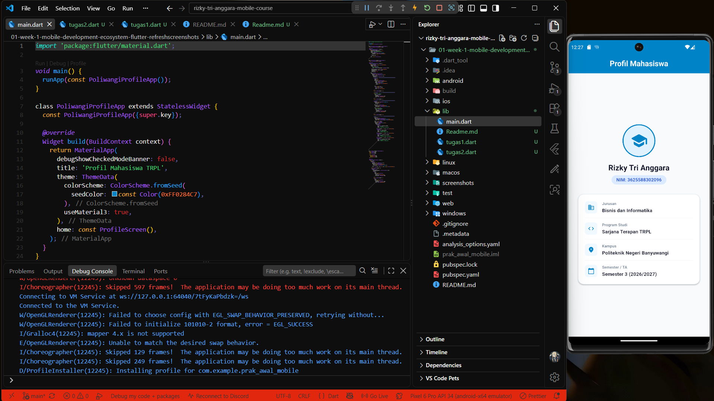
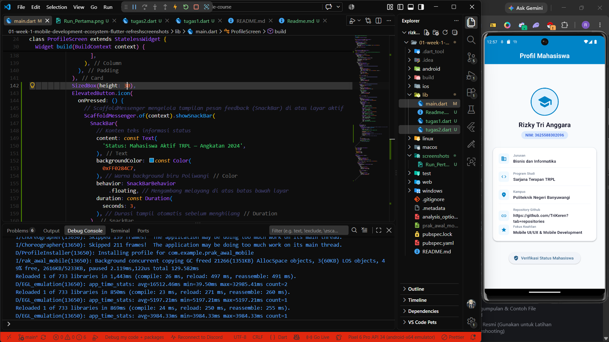

# Laporan Praktikum Modul 01: Mobile Ecosystem, Flutter Setup & Profile App

- **Nama**: Rizky Tri Anggara
- **NIM**: 362558302096
- **Kelas / Prodi**: 2C / Sarjana Terapan TRPL
- **Mata Kuliah**: Pemrograman Perangkat Bergerak (Semester 3)

---

## 1. Ringkasan Aktivitas
[Tuliskan 1-2 paragraf tentang apa yang Anda pelajari dan kerjakan pada minggu ini]
Hal yang saya pelajari di minggu ini mengenai cara setup flutter menggunakan editor Visual Studio Code. Selain itu juga memahami terkait penggunaan widget dan state. Juga mempelajari penggunaan github untuk push sebuah folder project ke repository kita.

## 2. Bukti Tangkapan Layar (Running App)
[Sertakan minimal 2 screenshot bukti aplikasi profil berjalan di emulator atau HP fisik Anda]

## 3. Kendala yang Dihadapi & Solusinya
- **Kendala**: Kendala yang terjadi saat pengujian flutter ini yaitu flutter sempat tidak terbaca saat sudah di install
- **Solusi**: Membuka environment lalu copy paste directory flutter yang udah di install ke dalam PATH

## 4. Jawaban Pertanyaan Refleksi
1. **Pilihan Native vs Flutter**:
Saya akan memilih Native (Kotlin untuk Android atau Swift untuk iOS) ketika aplikasi membutuhkan akses yang sangat spesifik terhadap fitur perangkat, performa maksimal, atau integrasi mendalam dengan sistem operasi. Contohnya aplikasi yang banyak menggunakan kamera, Bluetooth, sensor, background service.

Sedangkan Flutter lebih cocok jika ingin mengembangkan aplikasi Android dan iOS dari satu codebase sehingga proses pengembangan lebih cepat dan efisien. 

2. **Prinsip UI = f(state)**:
Prinsip UI = f(state) membuat saya berpikir bahwa UI merupakan hasil dari kondisi/state aplikasi, bukan sesuatu yang harus diubah secara manual satu per satu.

Pada pendekatan Android XML imperatif, kita biasanya mengubah tampilan secara langsung, misalnya mencari komponen dengan findViewById() kemudian mengubah text, visibility, atau background ketika suatu kondisi terjadi.

Sementara pada pendekatan deklaratif seperti Flutter atau Jetpack Compose, kita cukup mengubah state, kemudian framework akan menyesuaikan UI berdasarkan state tersebut.

3. **Pentingnya Conventional Commits**:
Commit kecil dan bermakna penting karena membuat perubahan kode lebih mudah dipahami dan direview oleh anggota tim. Jika terjadi error, kita juga lebih mudah mengetahui perubahan mana yang kemungkinan menyebabkan masalah.